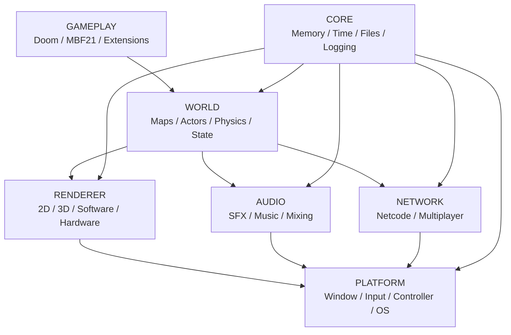
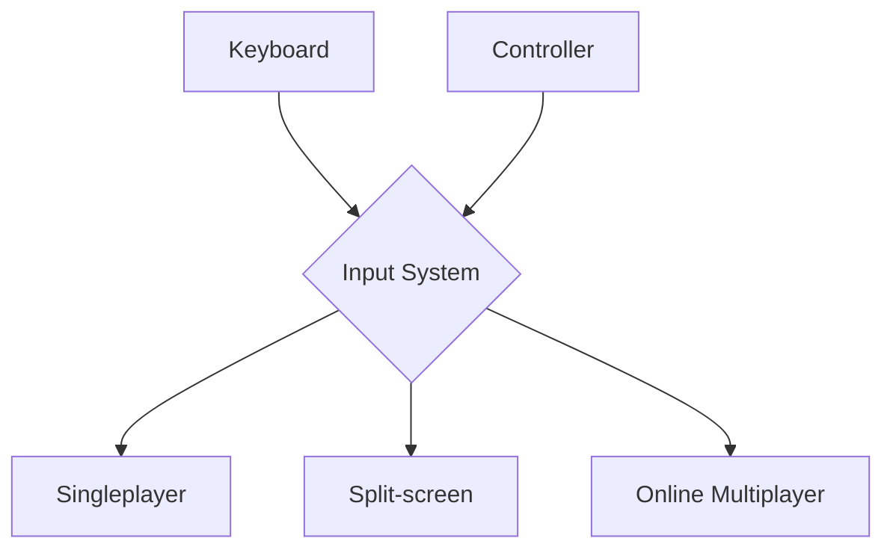

# Architecture

The engine will be organized into independent modules, aiming to reduce coupling between the different systems.
A simplified view of the architecture:

One of the project's principles will be to keep the game simulation independent from the way players provide their inputs.
This will make it possible to use the same logic for:

