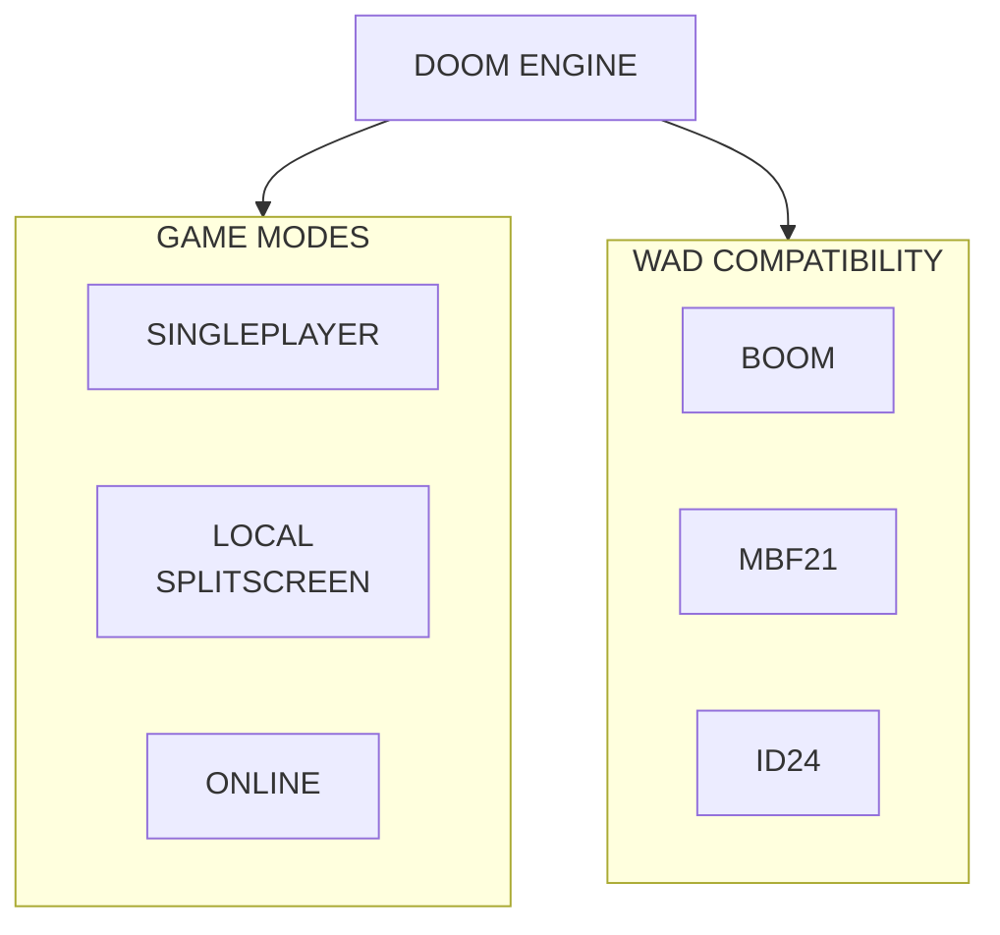

# Vision

In the long term, the intention is to build an engine capable of providing:

An engine that prioritizes compatibility, multiplayer, and predictability, without losing the simplicity and philosophy that have kept Doom relevant decades after its release.