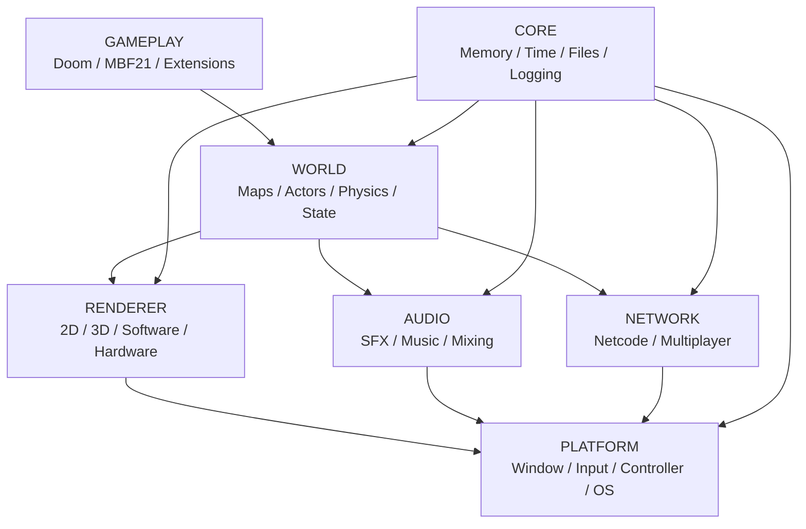
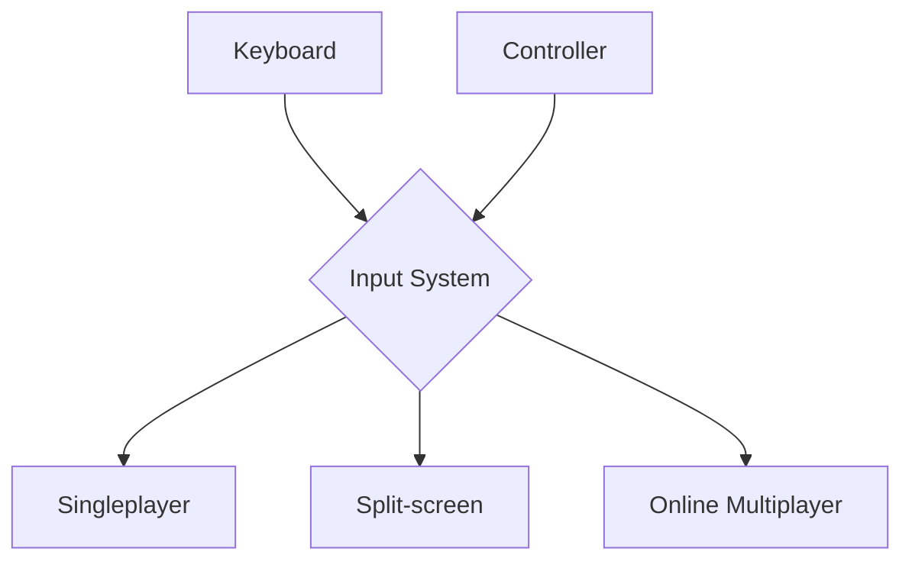
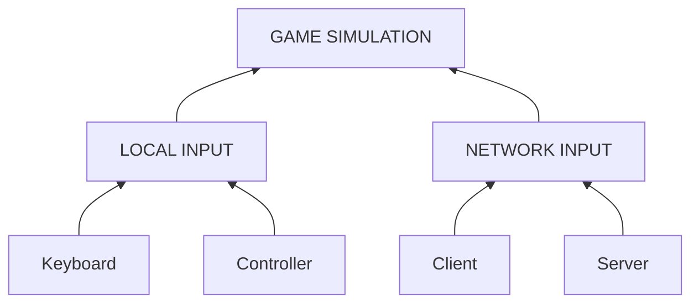
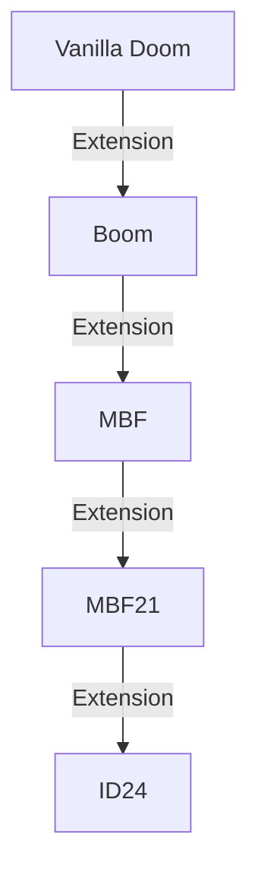
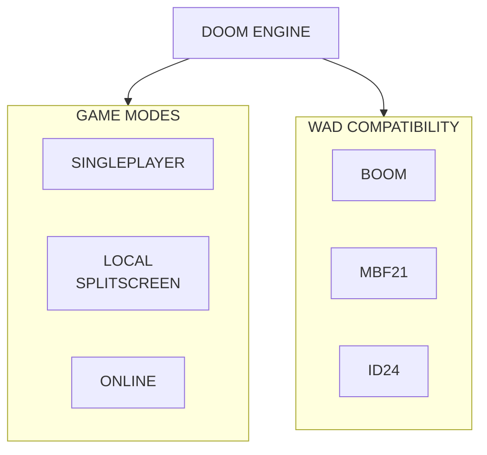

# --- BahDoom Engine ---

An engine inspired by Doom, developed from scratch in C, with a focus on learning, engine architecture, compatibility with the Doom ecosystem, and multiplayer.

The project was born from the idea of understanding how a game engine works by building each layer gradually, from the game loop and memory management to WAD loading, rendering, and networking.

«Status: 🚧 Early development»


# Objective

The goal of this project is to develop a modern Doom engine that is modular and extensible while maintaining compatibility with specification standards already established by the community.

The main focus will be:

* Local multiplayer with split-screen
* Functional online multiplayer
* Compatibility with specifications such as MBF21 and ID24
* Modular architecture
* Tools for WAD analysis and validation
* Clear and detailed documentation
* Implementation in C to deepen low-level programming knowledge

The idea is not simply to create another source port, but to build an engine while understanding each component that makes it work.


# Main Objectives

Legend:
* [ ] - To do
* [x] - Done
* 🛠️ - Under making

Engine

* [x] Game loop
* [ ] Time system
* [ ] Memory management
* [ ] File system
* [x] Logging system
* [ ] Engine configuration
* [ ] Internal console

Platform

* [x] Window creation
* 🛠️ Keyboard
* [ ] Mouse
* [ ] Gamepads
* [ ] Audio
* [ ] Support for different operating systems

WAD

* [ ] IWAD loading
* [ ] PWAD loading
* [ ] Lump system
* [ ] Map identification
* [ ] VERTEXES reading
* [ ] LINEDEFS reading
* [ ] SIDEDEFS reading
* [ ] SECTORS reading
* [ ] THINGS reading
* [ ] NODES reading
* [ ] SSECTORS reading
* [ ] SEGS reading

Gameplay

* [ ] Player
* [ ] Movement
* [ ] Collision
* [ ] Weapons
* [ ] Ammunition
* [ ] Items
* [ ] Monsters
* [ ] Projectiles
* [ ] Damage
* [ ] Doors
* [ ] Elevators
* [ ] Platforms
* [ ] Teleporters
* [ ] Switches

Rendering

* [ ] Initial renderer
* [ ] Map rendering
* [ ] BSP
* [ ] Walls
* [ ] Flats
* [ ] Textures
* [ ] Sprites
* [ ] Visibility
* [ ] Lighting
* [ ] HUD

Multiplayer

* [ ] Local multiplayer
* [ ] 2-player split-screen
* [ ] 3-player split-screen
* [ ] 4-player split-screen
* [ ] Cooperative play
* [ ] Deathmatch
* [ ] LAN multiplayer
* [ ] Online multiplayer
* [ ] Client/Server
* [ ] Dedicated server
* [ ] Interpolation
* [ ] Prediction
* [ ] Reconnection
* [ ] Spectator

Compatibility

* [ ] Doom Vanilla
* [ ] Boom
* [ ] MBF
* [ ] MBF21
* [ ] ID24

Compatibility will be treated as documented specifications, rather than simply as a list of features.

Experimental

* [ ] Profile System
* [ ] Achievements System
* [ ] Modern Multiplayer
* [ ] Built-in PWAD/WAD loader & manager
* [ ] Wad Downloader
* [ ] System for distributing current wads/mods (with creators' consent)
* [ ] ACS
* [ ] Zscript (probably impossible and time demanding)


# Architecture

The engine will be organized into independent modules, aiming to reduce coupling between the different systems.
A simplified view of the architecture:



One of the project's principles will be to keep the game simulation independent from the way players provide their inputs.
This will make it possible to use the same logic for:




# Multiplayer First-Class

Multiplayer will not be treated as a feature added to the engine at a later stage.
The architecture will be planned from the beginning to support:



The simulation should receive player commands without necessarily needing to know where they came from.
This will make it possible to use the same foundation for singleplayer, split-screen, LAN, and online multiplayer.


# Split-screen

One of the main planned differentiators of the engine will be native local multiplayer support.
The goal is to support up to four players (or more).
Each player should have:

* independent camera;
* independent HUD;
* independent input;
* independent player state;
* appropriate audio for their perspective.


# WAD Compatibility

The engine intends to use clearly defined compatibility levels.
Conceptual example:


*This diagram represents the intended compatibility model and is not a complete representation of the historical or technical relationships between specifications.*

The intention is for a WAD to behave predictably according to the specification it was developed for.
The engine may also identify and report resources used by a WAD.


# Tools

One of the future goals is to develop auxiliary tools for the ecosystem.

WADCheck

A planned tool for analyzing WADs:

```
WADCheck mymap.wad

WAD INFORMATION
----------------
Type: PWAD
Maps: 5
Lumps: 421

Compatibility
-------------
Vanilla       ✓
Boom          ✓
MBF           ✓
MBF21         ✓
ID24          ✗

Multiplayer
------------
Co-op starts     ✓
DM starts        ✓
Player 4 start   ✗

Result
------
MBF21 compatible
```

The tool may eventually check for common compatibility and multiplayer issues.


# Technologies

The project is currently being developed using:

* C
* CMake
* CLion
* SDL3
* Git

External libraries and technologies will be added as needed by the engine.
The platform layer will use a cross-platform library to handle windowing, input, controllers, and other operating system features.


# Project Structure

The planned structure is approximately:

```
DoomEngine/
│
├── CMakeLists.txt
├── README.md
├── LICENSE
│
├── src/
│   ├── main.c
│   │
│   ├── core/
│   │   ├── engine.c
│   │   ├── engine.h
│   │   ├── memory.c
│   │   ├── memory.h
│   │   ├── time.c
│   │   ├── time.h
│   │   ├── log.c
│   │   └── log.h
│   │
│   ├── platform/
│   │   ├── platform.c
│   │   └── platform.h
│   │
│   ├── wad/
│   │   ├── wad.c
│   │   └── wad.h
│   │
│   ├── game/
│   │   ├── game.c
│   │   └── game.h
│   │
│   ├── render/
│   │   ├── renderer.c
│   │   └── renderer.h
│   │
│   ├── audio/
│   │
│   └── network/
│
├── include/
│
├── assets/
│
├── docs/
│   ├── architecture.md
│   ├── wad.md
│   ├── compatibility.md
│   ├── mbf21.md
│   ├── id24.md
│   └── networking.md
│
└── tests/
```

This structure may change as the architecture evolves.


# Roadmap

Legend:
* [ ] - To do
* [x] - Done
* 🛠️ - Under making

Phase 0 — Foundation

* [x] Create repository
* [x] Configure CMake
* [x] Configure development environment
* [x] Initial engine structure
* [x] Logging system
* [x] Game loop

Phase 1 — Platform

* [x] Window
* 🛠️ Input
* [ ] Gamepad
* [ ] Timer
* [ ] Basic file system

Phase 2 — Renderer

* [ ] Framebuffer
* [ ] Basic renderer
* [ ] Camera
* [ ] Rendering of simple geometry

Phase 3 — WAD

* [ ] WAD loader
* [ ] Lump directory
* [ ] Map parser
* [ ] Vertices
* [ ] Linedefs
* [ ] Sidedefs
* [ ] Sectors
* [ ] Things
* [ ] BSP

Phase 4 — Doom

* [ ] First playable map
* [ ] Movement
* [ ] Collision
* [ ] Weapons
* [ ] Enemies
* [ ] Items
* [ ] Interactions
* [ ] HUD

Phase 5 — Compatibility

* [ ] Vanilla
* [ ] Boom
* [ ] MBF
* [ ] MBF21
* [ ] ID24

Phase 6 — Multiplayer

* [ ] Second player
* [ ] Split-screen
* [ ] 4 local players
* [ ] Co-op
* [ ] Deathmatch
* [ ] LAN
* [ ] Client/Server
* [ ] Internet
* [ ] Dedicated Server

Phase 7 — Tools

* [ ] WADCheck
* [ ] Debugger
* [ ] Console
* [ ] Profiler
* [ ] Compatibility reports


# Documentation

Documentation will be maintained within the project itself.
Initial planning:

```
docs/
├── architecture.md
├── game-loop.md
├── memory.md
├── rendering.md
├── wad.md
├── compatibility.md
├── mbf21.md
├── id24.md
├── networking.md
└── multiplayer.md
````

The documentation will also serve as a record of the technical decisions made during development.


# Development Philosophy

This project is, above all, a learning project.
For this reason, some decisions may be less "practical" than simply using an existing engine or ready-made library.
The goal is to understand:

* how a game loop works;
* how memory is organized;
* how binary files are interpreted;
* how maps are stored;
* how BSP works;
* how a renderer transforms data into pixels;
* how a game simulation works;
* how multiplayer synchronizes players;
* how an engine can be organized into modules.

Simple, understandable, and well-documented code will be prioritized whenever possible.


# Contributions

The project is still in its early stages, and significant architectural changes are expected.
Contributions may be accepted as the engine matures.
Before making major changes, it is recommended to open an issue to discuss the proposal.


# Status

This project is in early development and is not currently a functional replacement for other Doom source ports.
APIs, architecture, internal formats, and code organization may change significantly during development.


# -- License --

The BahDoom source code is licensed under the GNU GPLv3 License.
This license applies only to original BahDoom code and other files explicitly identified as being part of the BahDoom project.

Doom IWADs
BahDoom does not include copyrighted Doom IWAD files such as "DOOM.WAD", "DOOM1.WAD", or "DOOM2.WAD".
Users are responsible for obtaining any required IWADs from legitimate sources.
BahDoom is an independent project and is not affiliated with, endorsed by, or officially associated with id Software or Bethesda Softworks.

Third-Party Software
BahDoom may use third-party libraries and software components. These components remain subject to their respective licenses.
See "THIRD_PARTY_LICENSES.md" for details.

Mods and WADs
BahDoom may provide compatibility with Doom-family WADs, mods, map formats, and scripting systems.
Compatibility with a format or technology does not imply ownership of, or permission to redistribute, copyrighted content created by third parties.
Copyright and licensing of individual WADs, mods, assets, scripts, and other third-party content remain with their respective authors and copyright holders.
For additional information, see the project's license files and documentation.


# Vision

In the long term, the intention is to build an engine capable of providing:



An engine that prioritizes compatibility, multiplayer, and predictability, without losing the simplicity and philosophy that have kept Doom relevant decades after its release.
