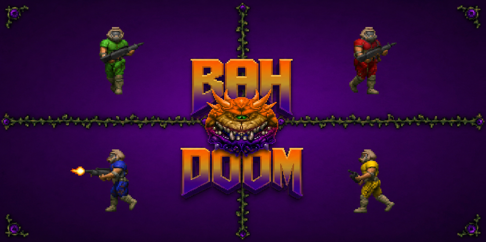
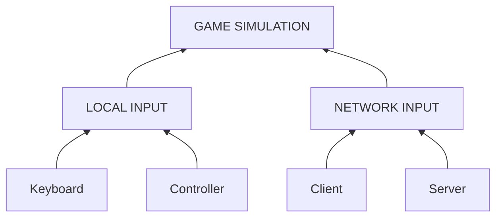
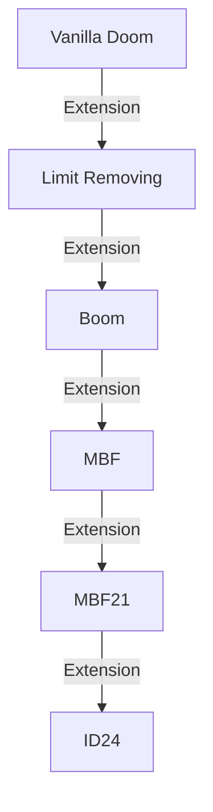
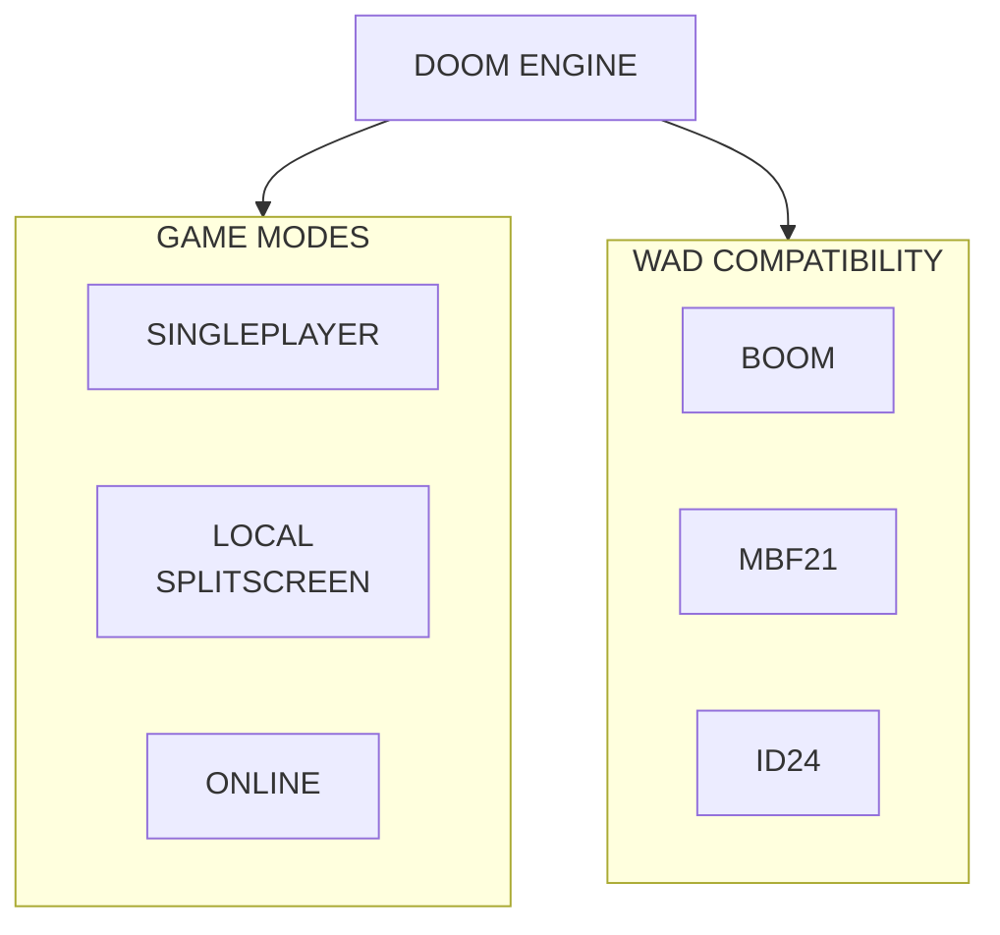

<p>
  
</p>

<h1>BahDoom Engine</h1>

[](docs/BAHDOOM_FULL_ROADMAP_CHECKLIST.md) 
[](docs/)

<p>
  An engine inspired by Doom, developed from scratch in C, with a focus on learning, engine architecture, compatibility with the Doom ecosystem, and multiplayer.
The project was born from the idea of understanding how a game engine works by building each layer gradually, from the game loop and memory management to WAD loading, rendering, and networking.
</p>

# Central Objective

The goal of this project is to develop a modern Doom engine that is modular and extensible while maintaining compatibility with specification standards already established by the community.

The main focus will be:

* Local multiplayer with split-screen
* Functional online multiplayer
* Compatibility with specifications such as MBF21 and ID24
* Modular architecture
* Tools for WAD analysis and validation
* Clear and detailed documentation
* Implementation in C to deepen low-level programming knowledge

The idea is not simply to create another source port, but to build an engine while understanding each component that makes it work.

# Multiplayer First-Class

Multiplayer will not be treated as a feature added to the engine at a later stage.
The architecture will be planned from the beginning to support:



The simulation should receive player commands without necessarily needing to know where they came from.
This will make it possible to use the same foundation for singleplayer, split-screen, LAN, and online multiplayer.


# Split-screen

One of the main planned differentiators of the engine will be native local multiplayer support.
The goal is to support up to four players (or more).
Each player should have:

* independent camera;
* independent HUD;
* independent input;
* independent player state;
* appropriate audio for their perspective.


# WAD Compatibility

The engine intends to use clearly defined compatibility levels.
Conceptual example:


*This diagram represents the intended compatibility model and is not a complete representation of the historical or technical relationships between specifications.*

The intention is for a WAD to behave predictably according to the specification it was developed for.
The engine may also identify and report resources used by a WAD.

# Documentation

Documentation will be maintained within the project itself, and it contains all the extra details and explanations about the vision, architecture, how to contribute, etc.

Initial planning:

```
docs/
├── architecture.md
├── game-loop.md
├── memory.md
├── rendering.md
├── wad.md
├── compatibility.md
├── mbf21.md
├── id24.md
├── networking.md
└── multiplayer.md
````

The documentation will also serve as a record of the technical decisions made during development.

# Philosophy and Vision

### Development Philosophy
This project is, above all, a learning project.
For this reason, some decisions may be less "practical" than simply using an existing engine or ready-made library.
The goal is to understand:

* how a game loop works;
* how memory is organized;
* how binary files are interpreted;
* how maps are stored;
* how BSP works;
* how a renderer transforms data into pixels;
* how a game simulation works;
* how multiplayer synchronizes players;
* how an engine can be organized into modules.

Simple, understandable, and well-documented code will be prioritized whenever possible.

### Vision
In the long term, the intention is to build an engine capable of providing:



An engine that prioritizes compatibility, multiplayer, and predictability, without losing the simplicity and philosophy that have kept Doom relevant decades after its release.

# Detailed Status

This project is in early development and is not currently a functional replacement for other Doom source ports.
APIs, architecture, internal formats, and code organization may change significantly during development.

Compatibility

* [ ] Doom Vanilla
* [ ] Limit Removing
* [ ] Boom
* [ ] MBF
* [ ] MBF21
* [ ] ID24

Compatibility will be treated as documented specifications, rather than simply as a list of features.

Experimental

* [ ] Profile System
* [ ] Achievements System
* [ ] Modern Multiplayer
* [ ] Built-in PWAD/WAD loader & manager
* [ ] Wad Downloader
* [ ] System for distributing current wads/mods (with creators' consent)
* [ ] ACS
* [ ] Zscript (probably impossible and time demanding)